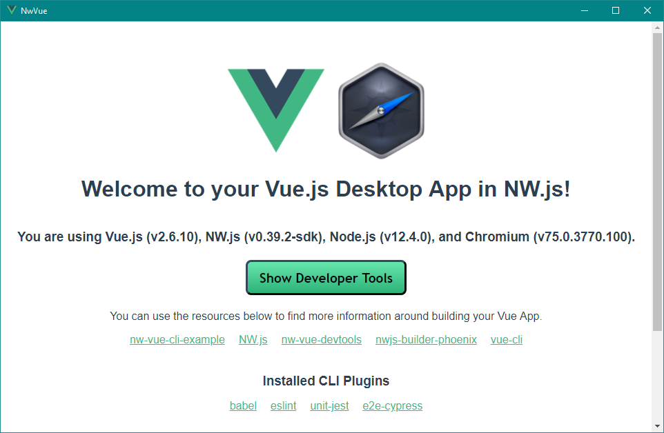

# nw-vue-cli-example

NW.js + Vue 2.x + Vue-CLI 4 example

* NW.js 0.48.2
  * Chrome 85
  * Node 14.10.1
* Vue-CLI 4.5.6
* Vue 2.6.12
* Vue-DevTools (latest)
* Babel
* ESLint
  * Vue Linting
  * A11Y Linting
  * Jest Linting
* Jest (100% test coverage)
* Jest Serializer Vue (TJW)

*Why not include Vue-Router or Vuex?*

Those are both very easily added from the Vue-CLI. There is also no custom styling libraries (Bulma, Bootstrap, etc), or meta-languages (Sass, TS, Pug, etc), or component libraries (Vuetify, Inkline, etc). This repo is meant to be the "go to" option for building all desktop apps with Vue. So it avoids pushing any particular choices on to you. With the exception of testing being set up for Jest, and Linting being set up to ensure minumum quality of this boilerplate repo itself. Both of which can be easily modified, ignored, or removed.

If you want to load the app with a splash screen, check the `nw-splasher` branch.

## Running Locally for development

1. `npm install`
1. `npm start`
1. Once Webpack finishes starting up your app will appear in a window

## Building for distribution

1. `npm run build:clean` will delete your `./dist` and `./dist-vue` folders
1. `npm run build:vue` will build just your Vue app for distribution (`./dist-vue`)
1. `npm run build:nw` will build just your NW.js app (`./dist`)
1. `npm run build` is your all-in-one command. It will clean out the old dist folders and build your Vue and NW.js app

# **IMPORTANT NOTE ABOUT BUILDS!!!**

They take a long time. If you do `npm run build` expect it to take 10-30 minutes. This can be adjusted by changing the build params in the `package.json`. The more platforms and build types, the longer it takes. You can also remove the `--concurrent` from the `build:nw` script to see a status of what has been completed. This will allow individual pieces to finish faster, but the entire build will take longer.

## Automated quality enforcment

1. **Linting:** `npm run lint` - Uses rules in `./eslint.json`
1. **Unit tests:** `npm run test:unit` - [Jest](https://jestjs.io).
1. **End-to-end:** `npm run test:e2e` - Accepting PR to make tests run in NW.js. - [Nightwatch](https://nightwatchjs.org).

### Customize configuration

Want Vue-Router? Vuex? Use the Vue-CLI to add them:

* [Vue-CLI documentation](https://cli.vuejs.org/config).

* * *

## Updating Vue-DevTools

To update your version of Vue-DevTools run `npm run update:vue-devtools`.

This will download the source code for the latest version of Vue-DevTools and do a custom build for NW.js. This ensures you always have the latest version.

* * *

## Alternatives

* [nwjs-vue](https://github.com/elegantweb/nwjs-vue) - Uses Vue-CLI 2
* [vue-desktop-basic](https://github.com/TheJaredWilcurt/vue-desktop-basic) - Does not use a build system at all, all `.vue` files run directly in the browser context

* * *

## Maintainence of this repo

This is not for those *using* this repo, but for those *maintaining* it.

1. When updating the version of NW.js devDependency, also update these:
   * `package.json` devDeps, build nwVersion
   * `tests/unit/setup.js`
   * `tests/unit/components/__snapshots__/HelloWorld.test.js.snap`
   * `.browserslistrc`
1. Update the version numbers at the top of the README
1. Bump the version number, and all the npm scripts that reference the version number
1. Run `npm run regression` after updating dependencies or other major changes to verify builds still work correctly
